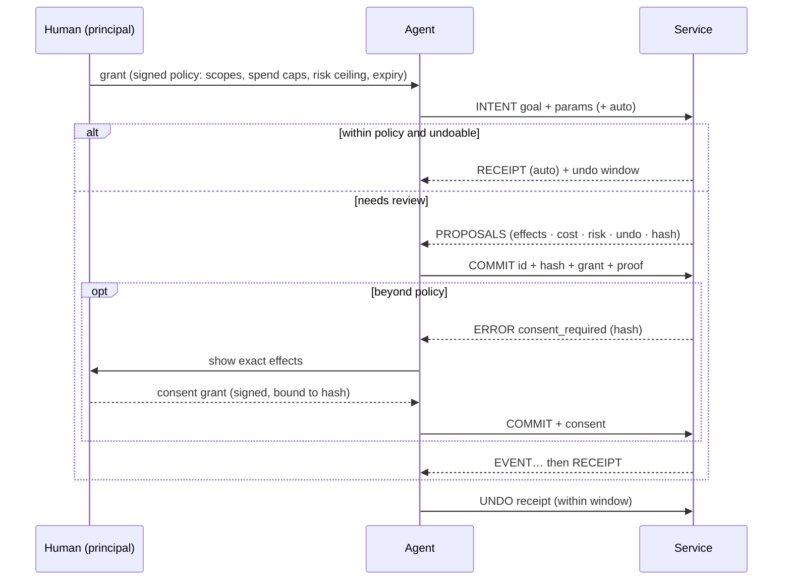

<div align="center">

# Parley

### HTTP was built for browsers. Parley is built for agents.

**An open protocol for AI agents acting on behalf of people.**<br>
Agents state an intent. Services reply with proposals whose effects are listed up front.
The human's signed policy decides what can go ahead without asking, and reversible
commits come with an undo window.

[Spec](SPEC.md) · [Demo](#see-it) · [Benchmark](#numbers) · [Quickstart](#quickstart) · [Use it from Claude today](#use-it-from-claude-code-today) · [Design](docs/design.md)

   


</div>

---

The web gave humans pages and gave code APIs. Agents got neither. Today an agent does real
work by stitching CRUD endpoints together. It reads JSON that it pays for by the token,
and it changes things with no standard way to see the effects first, undo them, or prove
that the human allowed *this* action at *this* price. Its credentials are scoped to
resources, not to amounts, risk or a specific action. MCP made those endpoints easy to
plug in, but it kept the endpoint shape.

**Parley goes back to the protocol layer.** It's an application protocol with its own
verbs, reply kinds, errors, authorization model and a canonical text format for models.
It's a peer of HTTP, not a wrapper around it.

```
agent ──INTENT "move my 1:1 with Ana to Thursday"────────────────▶ service
      ◀─PROPOSALS [p1] ~ event/e2.start 14:00 → Thu 15:00 · undo 1d · free
agent ──COMMIT p1 + grant (signed by the human's key)───────────▶
      ◀─RECEIPT ✓ moved · undo until Fri 15:00
agent ──UNDO r1 (the human changed their mind)──────────────────▶
      ◀─RECEIPT ↶ undid r1
```

## What changes

| The agent-era problem | What Parley does |
|---|---|
| Agents want **outcomes**, but APIs expose **CRUD** | `INTENT` carries the goal, and the service answers with concrete **proposals** |
| Agents make mistakes | Nothing happens until `COMMIT`. Every proposal lists its **effects, cost, risk and undo window**, and its hash binds the commit to exactly what was shown |
| "Are you sure?" isn't a protocol primitive | **Policy-gated auto-commit**: the human's grant decides what can skip review. Low-risk, undoable changes take one round trip; costly, risky or irreversible ones stop for review |
| Undo is an afterthought | Reversible proposals declare an undo window, receipts carry it, and `UNDO` is a verb (effects that can't be reversed, like a sent email, are marked as such) |
| Context windows are expensive | Every request carries a **token budget**. Replies fit inside it and leave `EXPAND` handles for the rest |
| Models read text; APIs return JSON for code | **Lens** is a canonical, deterministic, compact text rendering of every message, defined in the spec and byte-identical across implementations |
| Credentials are scoped to resources, not to money, risk or a specific action | **Grants** are Ed25519 capability chains with spend caps, expiry, service and capability scopes, and risk ceilings. They're verified offline and can be delegated to sub-agents but only narrowed |
| A human approval is a checkbox in someone's UI | **Consent** is a one-shot signed grant for `COMMIT` of one exact proposal hash, and nothing else |
| Errors say *what* failed | Errors say **how to fix it**, with machine-applicable patches. Ambiguity is a first-class reply (`CLARIFY`), not an error |

## See it

`npm run demo` runs this over real TCP sockets. Everything under `│` is exactly what the
model reads. The human's taps are simulated in code. Excerpt from
[this run's full transcript](docs/demo-transcript.txt):

```
1. 👤 human delegates to the agent with a policy, not a password:
   │ services: calendar.example, shop.example
   │ risk ≤ low · ≤ 40.00 USD per action · ≤ 100.00 USD total · expires in 8h

3. 🤖 agent "move my 1:1 with Ana to 2026-09-27", said with intent instead of CRUD calls:
   → INTENT calendar.reschedule {event:"Ana", day:"2026-09-27"} auto
   │ ? 3 events match "Ana". Which one?
   │   1. 1:1 with Ana · 2026-09-25T14:00:00Z · ana.ruiz@acme.co
   │   2. Design review · 2026-09-25T16:00:00Z · ana.ruiz@acme.co, lee@acme.co
   │   3. Pipeline sync with Ana · 2026-09-26T11:00:00Z · ana.li@acme.co

4. 🤖 agent picks option 1. It's low-risk and undoable, and the policy allows that, so it commits in the same round trip:
   → INTENT calendar.reschedule {"event":"e2","day":"2026-09-27"} auto
   │ ✓ Move "1:1 with Ana" to 2026-09-27T09:30:00Z (receipt r_JXmu6mtf) · undo until 2026-09-25T02:17:34Z
   │   ~ update event/e2.start: 2026-09-25T14:00:00Z → 2026-09-27T09:30:00Z
   │   > send ana.ruiz@acme.co — updated invite

5. 👤 human (simulated) "wait, not that day." The agent undoes it:
   → UNDO r_JXmu6mtf
   │ ↶ undid r_JXmu6mtf: Move "1:1 with Ana" to 2026-09-27T09:30:00Z (receipt r_KRSogfx_)

6. 🤖 agent searches the 60-item menu for vegan meals with a 250-token budget; the rest waits behind a handle:
   → ASK shop.search {tag:"vegan"} budget=250
   │ items[7]{sku,name,usd,cal,protein}:
   │   m005,Falafel Plate,16.47,632,46
   │   m007,Tofu Pad Thai,19.21,738,30
   │   …
   │ … 8 more at data — EXPAND h_KN9Sbg8526kK (~155 tokens)

7. 🤖 agent orders 4 meals. It's over the 40.00 USD per-action limit, so no auto-commit, just proposals:
   → INTENT shop.order {items:[m005×2, m007×2], deliver:"2026-09-26"} auto
   │ 2 proposals — undo: 2h · expires: 2026-09-24T02:28Z:
   │ [p_GCFpf4dl] 4 meals for 2026-09-26 — 71.36 USD
   │   + create order/o1001 — 2× Falafel Plate, 2× Tofu Pad Thai
   │   $ charge card ••4242 — 71.36 USD
   │   cost: 71.36 USD · risk: low
   │   …
   │ [p_A4Dy2FmC] 4 meals for 2026-09-26 (express, by noon) — 80.35 USD
   │   …

8. 🤖 agent commits [p_GCFpf4dl]:
   │ ✗ consent_required: cost exceeds the per-commit limit of 40.00 USD; your principal must approve this exact proposal

9. 👤 human (simulated) gets a push notification, reads the exact effects and taps Approve, which signs a one-time consent for this proposal only:
   → COMMIT p_GCFpf4dl + consent grant
   │ … authorizing card (30%)
   │ … order placed with kitchen (90%)
   │ ✓ 4 meals for 2026-09-26 — 71.36 USD (receipt r_SnSl2Gc2) · undo until 2026-09-24T04:17:34Z

11. 🤖 sub-agent (holding a narrowed, read-only grant) tries to place an order anyway:
   │ ✗ forbidden: does not allow COMMIT
   │   need: [{"verbs":["HELLO","ASK","INTENT"]}]
```

## Numbers

The same tasks over the same data: a conventional REST-style MCP server (one tool per
endpoint, JSON results) versus Parley through its MCP bridge. Counts are real BPE tokens
(o200k), and runs are deterministic. **Total input** is what you actually pay for: every
turn re-reads the tool definitions and the conversation so far.
[Method, raw payloads and caveats →](bench/RESULTS.md)

| Task | Calls (REST → Parley) | Total input: REST minified JSON | REST pretty JSON | Parley | Saved vs minified | vs pretty |
|---|---|---|---|---|---|---|
| Reschedule a meeting (REST: search → free slots → update) | 3 → 1 | 3,679 | 3,834 | 1,454 | **60%** | 62% |
| Reschedule a meeting (REST: one outcome-level endpoint) | 1 → 1 | 1,545 | 1,566 | 1,454 | **6%** | 7% |
| Find vegan meals < 700 kcal and order four | 2 → 2 | 3,080 | 3,542 | 2,567 | **17%** | 28% |
| Read the full 60-item menu | 1 → 1 | 3,388 | 4,488 | 2,401 | **29%** | 47% |
| Skim the menu (first 30 items: REST limit=30, Parley budget=800) | 1 → 1 | 2,403 | 2,963 | 1,867 | **22%** | 37% |
| **All tasks** (CRUD reschedule row) | | 12,550 | 14,827 | 8,289 | **34%** | 44% |

How to read this honestly:
- **Minified JSON is the fair baseline.** Against it Parley saves 34% overall. Pretty-printed JSON is shown because many servers return it.
- **Most of the reschedule win is API design, not protocol.** Against a REST server that also offers an outcome-level `reschedule_event` endpoint, Parley saves only 6%. The protocol's contribution there is what comes back: effects, policy and undo, which the REST endpoint doesn't give.
- **Lens is where the protocol itself saves tokens.** The same 60 menu items cost 1,095 tokens in Lens against 1,919 in minified JSON.
- **Tokens aren't the point of the preview step.** An early version of this benchmark (before auto-commit) had Parley *losing* on multi-step tasks, because proposals cost a round trip. That led to [policy-gated auto-commit](SPEC.md#431-policy-gated-auto-commit) and to hoisting shared proposal attributes in Lens.

`npm run bench` reproduces all of it.

## Tested with a real model

We gave Claude Sonnet 5, running in headless Claude Code, the Parley MCP bridge, **no
Parley documentation**, and one request: *"Move my 1:1 with Ana to a free slot on the
27th, then order me 4 vegan meals under 700 calories."* Its grant allowed low-risk
changes up to $40 per action.

It read Lens cold and moved the meeting (within policy, 24h undo). It built the order,
hit `consent_required` at $53.95, and stopped. Unprompted, it told the user:

> *"I didn't try to get around the limit. Splitting it into two orders would have dodged the check. Even the cheapest four meals come to $53.95, so no single order fits under $40."*

Then it handed the human the approval command. (It ran without shell access. See
[key placement](#keep-the-principal-key-away-from-the-agent) for why that matters.)
[Full unedited transcript →](docs/claude-code-session.md) (9 turns, $0.19)

## The protocol in one screen

**Verbs:** `HELLO` (discover) · `ASK` (read, never changes anything) · `INTENT` (propose) ·
`COMMIT` (execute a proposal) · `UNDO` · `EXPAND` (fetch what the budget elided)

**Replies:** `BRIEF` · `ANSWER` · `PROPOSALS` · `CLARIFY` · `RECEIPT` · `ERROR` · `EVENT` (progress, non-final)

**Wire:** NDJSON frames over TCP (`parley://`, port 7447), TLS (`parleys://`), stdio, or
an HTTP bridge (`POST /parley` with an NDJSON response, plus discovery at
`/.well-known/parley`) for serverless and existing infrastructure.



Read the [full specification](SPEC.md). It's short on purpose.

## Quickstart

```sh
npm install parley-protocol        # TypeScript/JavaScript: Node ≥ 20, Bun, Deno (web-standard APIs only)
pip install parley-protocol        # Python ≥ 3.10
```

> Packages aren't published yet. Until they are: `git clone`, then `npm install && npm run build && npm link -w parley-protocol`
> for the `parley` CLI, and `pip install ./python`.

### Build a service

```ts
import { service, update, send, clarify } from "parley-protocol";
import { listen } from "parley-protocol/node";

const cal = service({ id: "cal.example.com", name: "Calendar", summary: "Move meetings.", trust: [PRINCIPAL_KEY] })
  .ask("calendar.agenda", {
    summary: "Upcoming events",
    params: { "day?": "date" },
    run: ({ params }) => db.events(params.day),
  })
  .intent("calendar.reschedule", {
    summary: "Move a meeting",
    params: { event: "string — id or title", to: "datetime" },
    plan: ({ params }) => {
      const matches = db.find(params.event);
      if (matches.length > 1) return clarify("Which one?", matches.map((e) => ({ label: e.title, params: { event: e.id } })));
      const e = matches[0], before = e.start;
      return {
        summary: `Move "${e.title}" to ${params.to}`,
        effects: [update(`event/${e.id}`, "start", before, params.to), send(e.owner, "updated invite")],
        apply: () => db.move(e.id, params.to),   // runs only on COMMIT, at most once
        revert: () => db.move(e.id, before),     // present, so the proposal is undoable
        undoWindow: 86400,
      };
    },
  });

await listen(cal); // parley://127.0.0.1:7447, or serveHttp(cal) / fetchHandler(cal) for Workers, Bun and Deno
```

Params are validated against the compact schema automatically, and typos get fixes like
``rename `dya` to `day` ``. Budgets, `EXPAND`, idempotent commits, replay protection,
grant verification, spend accounting and consent are all handled for you.

### Act as an agent

```ts
import { connect } from "parley-protocol/node";

const cal = await connect("parley://cal.example.com", { key: AGENT_SEED, grants: [GRANT] });
const r = await cal.intent("calendar.reschedule", { event: "Ana", to: "2026-09-24T15:00:00Z" }, { auto: true });
console.log(r.lens); // ← give this to your model
if (r.kind === "PROPOSALS") await cal.commit(r.proposals[0]);
```

Python has the same concepts in snake_case (`issue_grant`, `consent_grant`, `lens`, `connect`), with decorators and a `Plan` dataclass instead of chaining. The CLI and MCP bridge are TypeScript-only. See [python/README.md](python/README.md).

### Delegate like you mean it

```sh
parley init                                              # your principal key + an agent key (~/.parley)
parley grant --svc cal.example.com --svc shop.example \
             --risk low --per 40USD --spend 100USD --exp 8h   # signed policy for your agent
parley inspect <token>                                   # read any grant chain
parley delegate <token> --to <sub-agent key> --verbs ASK,INTENT   # narrower authority for a sub-agent
parley approve <pc1.code>                               # review and sign a one-time consent for one proposal
parley do parley://cal.example.com calendar.reschedule event=Ana   # interactive: intent → pick → commit
```

## Use it from Claude Code today

The bridge exposes any Parley services as an MCP server, so every MCP client (Claude
Code, Claude Desktop, Cursor and others) can use them now. Tool results are Lens.

```sh
parley init
parley grant --svc cal.example.com --svc shop.example --risk low --per 25USD --spend 100USD --exp 24h
claude mcp add parley -- npx parley-protocol mcp parley://127.0.0.1:7447 https://shop.example/parley
```

Try it against the examples: `npm run build && PARLEY_TRUST=$(parley whoami | awk '/principal/{print $2}') node examples/serve.ts`.

When a commit needs consent, the bridge never approves on the model's behalf. If the
client supports MCP elicitation, it asks **the human** in the client's UI. Otherwise it
tells the model to ask the human to run `parley approve <code>`, which shows the exact
action and requires an interactive confirmation.

### Keep the principal key away from the agent

A grant is only as strong as the principal key's isolation. `parley init` puts the
principal key and the agent key in `~/.parley` for convenience. **If your agent has
shell or file access (Claude Code does), it could read the principal key and sign its
own consent.** For anything that matters, keep the principal key somewhere the agent
can't reach: another OS user, another machine, or a phone. Set `PARLEY_PRINCIPAL_HOME`
to that location and approve there, and the agent's machine never holds it. Also pair
`--per` with `--spend`: a per-action cap alone can be dodged by splitting a purchase,
and `--spend` bounds the total.

## How it compares

| | REST / HTTP APIs | MCP | **Parley** |
|---|---|---|---|
| Unit of interaction | resource (CRUD) | tool call (usually wraps an endpoint) | **intent → proposal → commit** |
| Preview before side effects | rare, per-API (dry-run flags) | tool annotations (`destructiveHint` …) as hints only; no effect preview | **✓** effects, cost, risk and undo window on every proposal, bound by hash |
| Undo | per-API, if at all | not in the protocol | **✓** a protocol verb with declared windows |
| Delegation | API keys, OAuth scopes (resource-scoped) | OAuth at the transport | **✓** attenuable capability chains: spend caps, risk ceilings, sub-agent delegation, offline verification |
| Human approval | app-specific | elicitation (not bound to an action) | **✓** a consent grant signed over the exact proposal hash |
| Context budget | pagination / field selection, per-API | list pagination only | **✓** every reply fits the requested budget, with `EXPAND` for the rest |
| Model-facing format | JSON | text or structured content, per server; no canonical form | **✓** Lens: canonical, compact, byte-identical across implementations |
| Errors | status codes, RFC 9457 problem details | JSON-RPC codes, `isError` plus free text | **✓** machine-applicable fixes, and `CLARIFY` for ambiguity |
| Idempotency and replay | per-API (`Idempotency-Key`) | `idempotentHint` (hint only) | **✓** commits are idempotent; proofs are time-bound and key-bound |

Parley doesn't replace MCP's role as an integration layer. The bridge runs *on* MCP.
What Parley replaces is the thing MCP servers wrap: an API designed for code rather than
for delegated agents.

## What's in this repo

| Path | What |
|---|---|
| [`SPEC.md`](SPEC.md) | The protocol, v1 draft |
| [`conformance/`](conformance) | Language-neutral test vectors: canonical JSON, keys, hashes, proofs, grants, Lens and token estimates |
| [`ts/`](ts) | Reference implementation (TypeScript, **zero runtime dependencies**, WebCrypto): service, client, transports, CLI, MCP bridge |
| [`python/`](python) | Second implementation (Python), started from the spec and vectors, passing all of them, and interoperating with TS |
| [`examples/`](examples) | Calendar and meal-shop services, plus the narrated demo |
| [`bench/`](bench) | The token benchmark above |
| [`docs/design.md`](docs/design.md) | Why it's built this way: every major decision and the alternatives we rejected |

The two implementations interoperate in both directions over TCP and HTTP. The Python
suite also renders every TypeScript reply and event through its own Lens renderer and
checks the output is byte-identical. Writing the second implementation surfaced real
bugs in the first, including a consent-scoping hole and fail-open caveats, and every
fix went into the spec and vectors. See [design notes](docs/design.md).

```sh
npm install && npm test          # TypeScript: unit, conformance, transports, MCP bridge, TS→Python interop
cd python && uv run pytest       # Python: unit, conformance, Python→TS interop
npm run demo && npm run bench
```

## FAQ

**Isn't this just MCP?** No. MCP standardizes how a model *finds and calls tools*.
Parley standardizes what the tool *is*: an outcome-level interface with previews,
undo, delegated authority, budgets and a model-native format. The two compose: the
bridge serves Parley over MCP.

**Why a new protocol instead of HTTP conventions?** Previews, consent bound to hashes,
capability grants, budgets and Lens have to hold *across every service* to be worth
anything to an agent. Conventions layered on HTTP get implemented differently by every
API, which is how we got here. Parley can still ride HTTP (the bridge) where
infrastructure requires it. Its semantics just don't depend on it. [More →](docs/design.md)

**Does the model need to learn a new format?** No. Lens is designed to be read cold:
tables for uniform lists, `~ update`/`+ create`/`$ charge` effect lines, explicit costs
and undo windows. The benchmark uses exactly what an unmodified model reads.

**Why not JWT or OAuth for delegation?** They answer "who is this?" Agents need "what
exactly may this do, for whom, up to how much, until when, and can it hand a narrower
slice to a helper?" That's a capability chain (in the lineage of macaroons and Biscuit)
with caveats a service can check offline. [More →](docs/design.md#grants)

**Is it production-ready?** Not yet. It's a v1 draft with two conformant implementations,
~220 tests, and an adversarial security audit whose 15 findings are all fixed and covered
by regression tests ([details](docs/design.md#security-review)). The reference services keep state in memory. The protocol surface is deliberately small. Before 1.0: revocation lists,
multi-party atomic commits (`HOLD` across services), and a QUIC transport. See the
[roadmap](docs/design.md#roadmap). Feedback on the spec is the most valuable
contribution right now.

## License

Apache-2.0. The spec is free to implement.
