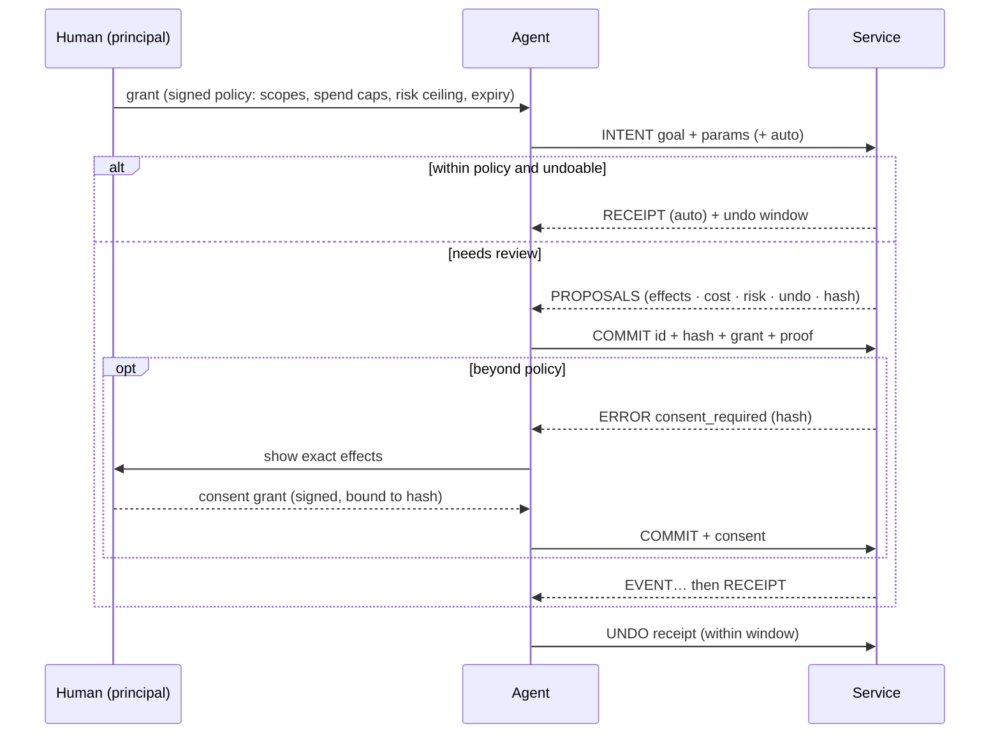

<div align="center">

# Parley

### HTTP was built for browsers. Parley is built for agents.

**An open protocol for AI agents acting on behalf of people.**<br>
Agents state an intent. Services reply with proposals whose effects are listed up front.
The human's policy decides what can go ahead without asking. Commits can be undone.

[Spec](SPEC.md) · [Demo](#see-it) · [Benchmark](#numbers) · [Quickstart](#quickstart) · [Use it from Claude today](#use-it-from-claude-code-today) · [Design](docs/design.md)

   

</div>

---

The web gave humans pages and gave code APIs. Agents got neither. Today an agent does real
work by stitching CRUD endpoints together. It reads bulky JSON that it pays for by the
token, and it changes things blind: it can't preview the change, can't undo it, and holds
a credential that can do anything its owner can do. MCP made those endpoints easy to plug
in, but it kept the endpoint shape.

**Parley goes back to the protocol layer.** It's an application protocol with its own
verbs, reply kinds, errors, authorization model and a canonical text format for models.
It's a peer of HTTP, not a wrapper around it.

```
agent ──INTENT "move my 1:1 with Ana to Thursday"────────────────▶ service
      ◀─PROPOSALS [p1] ~ event/e2.start 14:00 → Thu 15:00 · undo 1d · free
agent ──COMMIT p1 + grant (signed by the human's key)───────────▶
      ◀─RECEIPT ✓ moved · undo until Fri 15:00
agent ──UNDO r1 (the human changed their mind)──────────────────▶
      ◀─RECEIPT ↶ undid r1
```

## What changes

| The agent-era problem | What Parley does |
|---|---|
| Agents want **outcomes**, but APIs expose **CRUD** | `INTENT` carries the goal, and the service answers with concrete **proposals** |
| Agents make mistakes | Nothing happens until `COMMIT`. Every proposal lists its **effects, cost, risk and undo window**, and its hash binds the commit to exactly what was shown |
| "Are you sure?" isn't a protocol primitive | **Policy-gated auto-commit**: the human's grant decides what can skip review. Low-risk, undoable changes take one round trip; costly, risky or irreversible ones stop for review |
| Undo is an afterthought | Receipts carry an undo window, and `UNDO` is a verb |
| Context windows are expensive | Every request carries a **token budget**. Replies fit inside it and leave `EXPAND` handles for the rest |
| Models read text; APIs return JSON for code | **Lens** is a canonical, deterministic, compact text rendering of every message, defined in the spec and byte-identical across implementations |
| API keys are all-or-nothing | **Grants** are Ed25519 capability chains with spend caps, expiry, service and capability scopes, and risk ceilings. They're verified offline and can be delegated to sub-agents but only narrowed |
| A human approval is a checkbox in someone's UI | **Consent** is a one-shot signature over the exact proposal hash |
| Errors say *what* failed | Errors say **how to fix it**, with machine-applicable patches. Ambiguity is a first-class reply (`CLARIFY`), not an error |

## See it

`npm run demo` runs this over real TCP sockets. Everything under `│` is exactly what the
model reads ([full transcript](docs/demo-transcript.txt)).

```
1. 👤 human delegates to the agent with a policy, not a password:
   │ services: calendar.example, shop.example
   │ risk ≤ low · ≤ 40.00 USD per action · ≤ 100.00 USD total · expires in 8h

3. 🤖 agent "move my 1:1 with Ana to 2026-09-27", said with intent instead of CRUD calls:
   → INTENT calendar.reschedule {event:"Ana", day:"2026-09-27"} auto
   │ ? 3 events match "Ana". Which one?
   │   1. 1:1 with Ana · 2026-09-25T14:00:00Z · ana.ruiz@acme.co
   │   2. Design review · 2026-09-25T16:00:00Z · ana.ruiz@acme.co, lee@acme.co
   │   3. Pipeline sync with Ana · 2026-09-26T11:00:00Z · ana.li@acme.co

4. 🤖 agent picks option 1. The service knows it's low-risk and undoable, and the policy allows that, so it commits in the same round trip:
   │ ✓ Move "1:1 with Ana" to 2026-09-27T09:30:00Z (receipt r_F3BQMFcO) · undo until 2026-09-25T02:06:32Z
   │   ~ update event/e2.start: 2026-09-25T14:00:00Z → 2026-09-27T09:30:00Z
   │   > send ana.ruiz@acme.co — updated invite

5. 👤 human "wait, not that day." The agent undoes it:
   │ ↶ undid r_F3BQMFcO: Move "1:1 with Ana" to 2026-09-27T09:30:00Z (receipt r__7benwvw)

6. 🤖 agent browses a 60-item menu with a 250-token budget; the rest waits behind a handle:
   │ items[7]{sku,name,usd,cal,protein}:
   │   m005,Falafel Plate,16.47,632,46
   │   m007,Tofu Pad Thai,19.21,738,30
   │   …
   │ … 8 more at data — EXPAND h_20F74mmpWC1f (~155 tokens)

7. 🤖 agent orders 4 meals. It's over the 40.00 USD per-action limit, so no auto-commit, just proposals:
   │ 2 proposals — undo: 2h · expires: 2026-09-24T02:17Z:
   │ [p_pQeWkT0J] 4 meals for 2026-09-26 — 71.36 USD
   │   + create order/o1001 — 2× Falafel Plate, 2× Tofu Pad Thai
   │   $ charge card ••4242 — 71.36 USD
   │   cost: 71.36 USD · risk: low
   │ [p_6eVDOzhz] 4 meals for 2026-09-26 (express, by noon) — 80.35 USD
   │   …

8. 🤖 agent commits [p_pQeWkT0J]:
   │ ✗ consent_required: cost exceeds the per-commit limit of 40.00 USD; your principal must approve this exact proposal

9. 👤 human gets a push notification, reads the exact effects and taps Approve. That signs a one-time consent bound to the hash:
   │ … authorizing card (30%)
   │ … order placed with kitchen (90%)
   │ ✓ 4 meals for 2026-09-26 — 71.36 USD (receipt r_rQ_LoZx9) · undo until 2026-09-24T04:06:32Z

11. 🤖 sub-agent (holding a narrowed, read-only grant) tries to place an order anyway:
   │ ✗ forbidden: does not allow COMMIT
   │   need: [{"verbs":["HELLO","ASK","INTENT"]}]
```

## Numbers

The same tasks over the same data: a conventional REST-style MCP server (one tool per
endpoint, JSON results) versus Parley through its MCP bridge. Token counts are real BPE
counts (o200k). "Total input" is what you actually pay for: each turn re-reads the tool
definitions and the conversation so far. [Method and raw output →](bench/RESULTS.md)

| Task | Calls | Total input tokens | Saved |
|---|---|---|---|
| Reschedule a meeting into a free slot | 3 → **1** | 3,494 → 1,456 | **58%** |
| Find vegan meals under 700 kcal and order four | 2 → 2 | 3,289 → 2,567 | **22%** |
| Read the full 60-item menu | 1 → 1 | 4,318 → 2,401 | **44%** |
| Skim the menu (800-token budget) | 1 → 1 | 4,318 → 1,864 | **57%** |
| **All tasks, vs pretty JSON** (the usual MCP default) | | 15,419 → 8,288 | **46%** |
| **All tasks, vs minified JSON** (REST's best case) | | 12,598 → 8,286 | **34%** |

And the Parley agent did more with those tokens. It saw every effect before anything
happened, acted only within its principal's signed policy, and got an undo window back.
The REST agent had none of that.

> Honesty note: our first benchmark run showed Parley *losing* on multi-step tasks,
> because the preview step costs a round trip. That result led to policy-gated
> auto-commit and to Lens hoisting shared proposal attributes. Both changes are in
> [SPEC §4.3.1](SPEC.md#431-policy-gated-auto-commit) and §9. Run `npm run bench` yourself.

## The protocol in one screen

**Verbs:** `HELLO` (discover) · `ASK` (read, never changes anything) · `INTENT` (propose) ·
`COMMIT` (execute a proposal) · `UNDO` · `EXPAND` (fetch what the budget elided)

**Replies:** `BRIEF` · `ANSWER` · `PROPOSALS` · `CLARIFY` · `RECEIPT` · `ERROR` · `EVENT` (progress, non-final)

**Wire:** NDJSON frames over TCP (`parley://`, port 7447), TLS (`parleys://`), stdio, or
an HTTP bridge (`POST /parley` with an NDJSON response, plus discovery at
`/.well-known/parley`) for serverless and existing infrastructure.



Read the [full specification](SPEC.md). It's short on purpose.

## Quickstart

```sh
npm install parley-protocol        # TypeScript/JavaScript: Node ≥ 20, Bun, Deno, Workers, browsers
pip install parley-protocol        # Python ≥ 3.10
```

### Build a service

```ts
import { service, update, send, clarify } from "parley-protocol";
import { listen } from "parley-protocol/node";

const cal = service({ id: "cal.example.com", name: "Calendar", summary: "Move meetings.", trust: [PRINCIPAL_KEY] })
  .ask("calendar.agenda", {
    summary: "Upcoming events",
    params: { "day?": "date" },
    run: ({ params }) => db.events(params.day),
  })
  .intent("calendar.reschedule", {
    summary: "Move a meeting",
    params: { event: "string — id or title", to: "datetime" },
    plan: ({ params }) => {
      const matches = db.find(params.event);
      if (matches.length > 1) return clarify("Which one?", matches.map((e) => ({ label: e.title, params: { event: e.id } })));
      const e = matches[0], before = e.start;
      return {
        summary: `Move "${e.title}" to ${params.to}`,
        effects: [update(`event/${e.id}`, "start", before, params.to), send(e.owner, "updated invite")],
        apply: () => db.move(e.id, params.to),   // runs only on COMMIT, at most once
        revert: () => db.move(e.id, before),     // present, so the proposal is undoable
        undoWindow: 86400,
      };
    },
  });

await listen(cal); // parley://127.0.0.1:7447, or serveHttp(cal) / fetchHandler(cal) for Workers, Bun and Deno
```

Params are validated against the compact schema automatically, and typos get fixes like
``rename `dya` to `day` ``. Budgets, `EXPAND`, idempotent commits, replay protection,
grant verification, spend accounting and consent are all handled for you.

### Act as an agent

```ts
import { connect } from "parley-protocol/node";

const cal = await connect("parley://cal.example.com", { key: AGENT_SEED, grants: [GRANT] });
const r = await cal.intent("calendar.reschedule", { event: "Ana", to: "2026-09-24T15:00:00Z" }, { auto: true });
console.log(r.lens); // ← give this to your model
if (r.kind === "PROPOSALS") await cal.commit(r.proposals[0]);
```

Python has the same API in snake_case. See [python/README.md](python/README.md).

### Delegate like you mean it

```sh
parley init                                              # your principal key + an agent key (~/.parley)
parley grant --svc cal.example.com --svc shop.example \
             --risk low --per 40USD --spend 100USD --exp 8h   # signed policy for your agent
parley inspect <token>                                   # read any grant chain
parley delegate <token> --to <sub-agent key> --verbs ASK,INTENT   # narrower authority for a sub-agent
parley approve <hash>                                    # one-time consent for one exact proposal
parley do parley://cal.example.com calendar.reschedule event=Ana   # interactive: intent → pick → commit
```

## Use it from Claude Code today

The bridge exposes any Parley services as an MCP server, so every MCP client (Claude
Code, Claude Desktop, Cursor and others) can use them now. Tool results are Lens.
When a commit needs consent, the bridge asks **the human** through MCP elicitation.
The model can never approve its own request.

```sh
parley init && parley grant --risk low --per 25USD --exp 24h
claude mcp add parley -- npx parley-protocol mcp parley://127.0.0.1:7447 https://shop.example/parley
```

Try it against the examples: `npm run build && PARLEY_TRUST=$(parley whoami | awk '/principal/{print $2}') node examples/serve.ts`.

## How it compares

| | REST / HTTP APIs | MCP | **Parley** |
|---|---|---|---|
| Unit of interaction | resource (CRUD) | tool call (usually wraps an endpoint) | **intent → proposal → commit** |
| Preview before side effects | ✗ | ✗ | **✓** effects, cost, risk and undo on every proposal |
| Undo | per-API, if at all | ✗ | **✓** a protocol verb with windows |
| Delegation | API keys / OAuth scopes | OAuth (transport-level) | **✓** attenuable capability chains: spend caps, risk ceilings, sub-agent delegation, offline verification |
| Human approval | app-specific | elicitation (unbound) | **✓** consent signed over the exact proposal hash |
| Context budget | ✗ | ✗ | **✓** every reply fits the budget, with `EXPAND` for the rest |
| Model-native format | ✗ JSON | ✗ text/JSON, up to each server | **✓** Lens: canonical, compact, deterministic |
| Errors | status codes | free text | **✓** machine-applicable fixes, plus `CLARIFY` for ambiguity |
| Idempotency and replay safety | per-API | ✗ | **✓** commits are idempotent; proofs are time-bound and key-bound |

Parley doesn't replace MCP's role as an integration layer. The bridge runs *on* MCP.
What Parley replaces is the thing MCP servers wrap: an API designed for code rather than
for delegated agents.

## What's in this repo

| Path | What |
|---|---|
| [`SPEC.md`](SPEC.md) | The protocol, v1 draft |
| [`conformance/`](conformance) | Language-neutral test vectors: canonical JSON, keys, hashes, proofs, grants, Lens and token estimates |
| [`ts/`](ts) | Reference implementation (TypeScript, **zero runtime dependencies**, WebCrypto): service, client, transports, CLI, MCP bridge |
| [`python/`](python) | Independent second implementation (Python), built against the spec and passing the same vectors |
| [`examples/`](examples) | Calendar and meal-shop services, plus the narrated demo |
| [`bench/`](bench) | The token benchmark above |
| [`docs/design.md`](docs/design.md) | Why it's built this way: every major decision and the alternatives we rejected |

Two independent implementations interoperate in both directions over TCP and HTTP. The
Python suite also renders every TypeScript reply through its own Lens renderer and
checks the output is byte-identical.

```sh
npm install && npm test          # TypeScript: unit, conformance, transports, MCP bridge, TS→Python interop
cd python && uv run pytest       # Python: unit, conformance, Python→TS interop
npm run demo && npm run bench
```

## FAQ

**Isn't this just MCP?** No. MCP standardizes how a model *finds and calls tools*.
Parley standardizes what the tool *is*: an outcome-level interface with previews,
undo, delegated authority, budgets and a model-native format. The two compose: the
bridge serves Parley over MCP.

**Why a new protocol instead of HTTP conventions?** Previews, consent bound to hashes,
capability grants, budgets and Lens have to hold *across every service* to be worth
anything to an agent. Conventions layered on HTTP get implemented differently by every
API, which is how we got here. Parley can still ride HTTP (the bridge) where
infrastructure requires it. Its semantics just don't depend on it. [More →](docs/design.md)

**Does the model need to learn a new format?** No. Lens is designed to be read cold:
tables for uniform lists, `~ update`/`+ create`/`$ charge` effect lines, explicit costs
and undo windows. The benchmark uses exactly what an unmodified model reads.

**Why not JWT or OAuth for delegation?** They answer "who is this?" Agents need "what
exactly may this do, for whom, up to how much, until when, and can it hand a narrower
slice to a helper?" That's a capability chain (in the lineage of macaroons and Biscuit)
with caveats a service can check offline. [More →](docs/design.md#grants)

**Is it production-ready?** It's a v1 draft with two conformant implementations and a
test suite. The protocol surface is deliberately small. Before 1.0: revocation lists,
multi-party atomic commits (`HOLD` across services), and a QUIC transport. See the
[roadmap](docs/design.md#roadmap). Feedback on the spec is the most valuable
contribution right now.

## License

Apache-2.0. The spec is free to implement.
